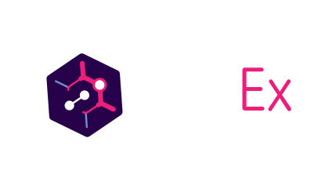
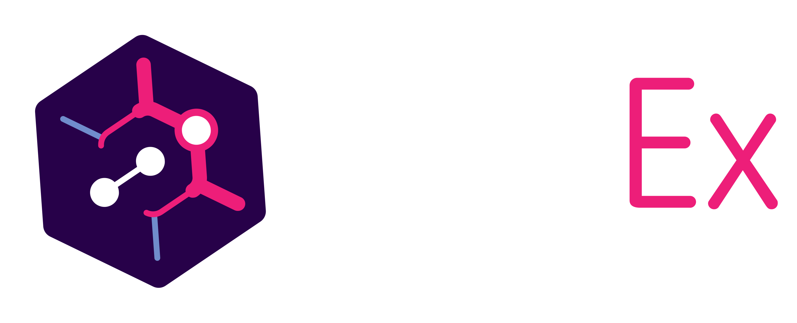
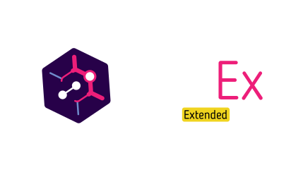
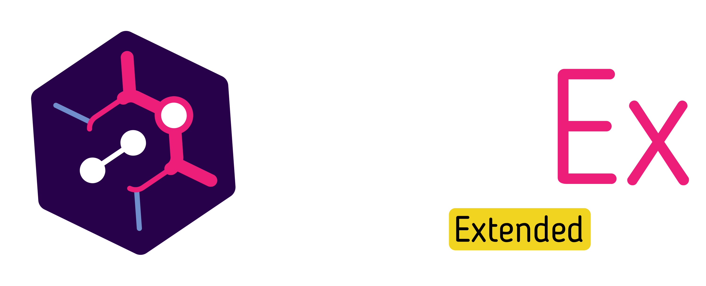
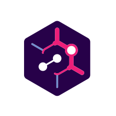
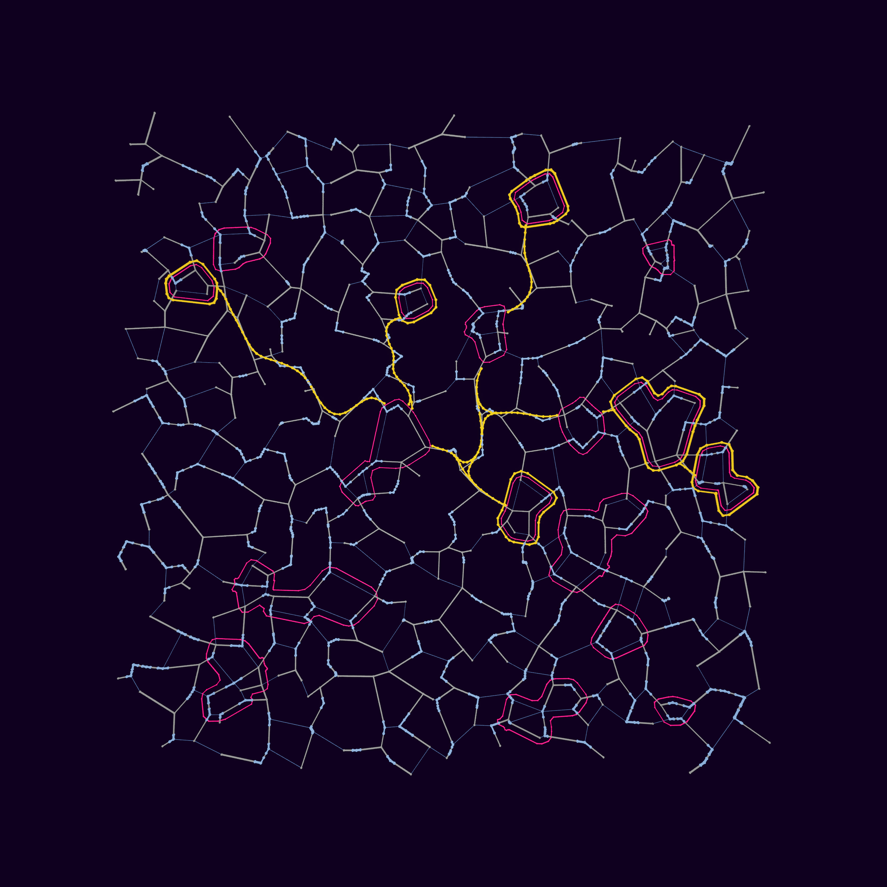
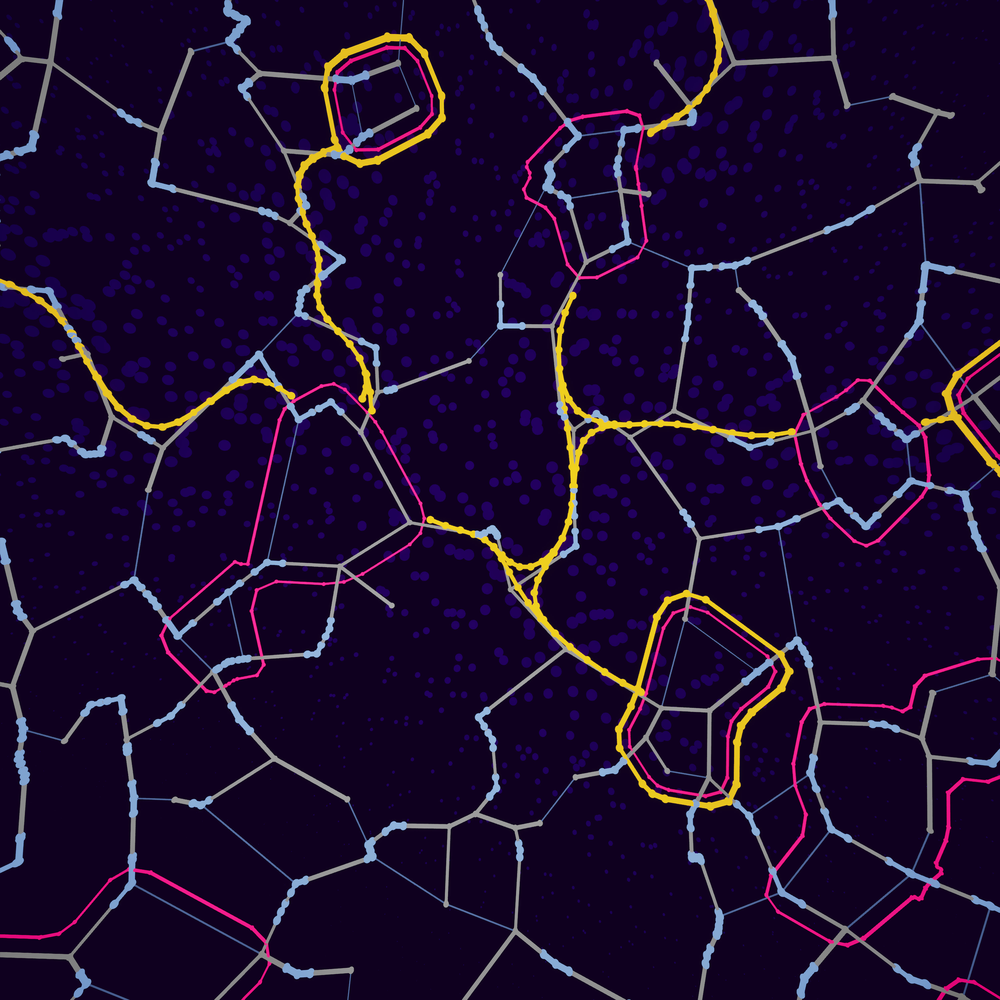
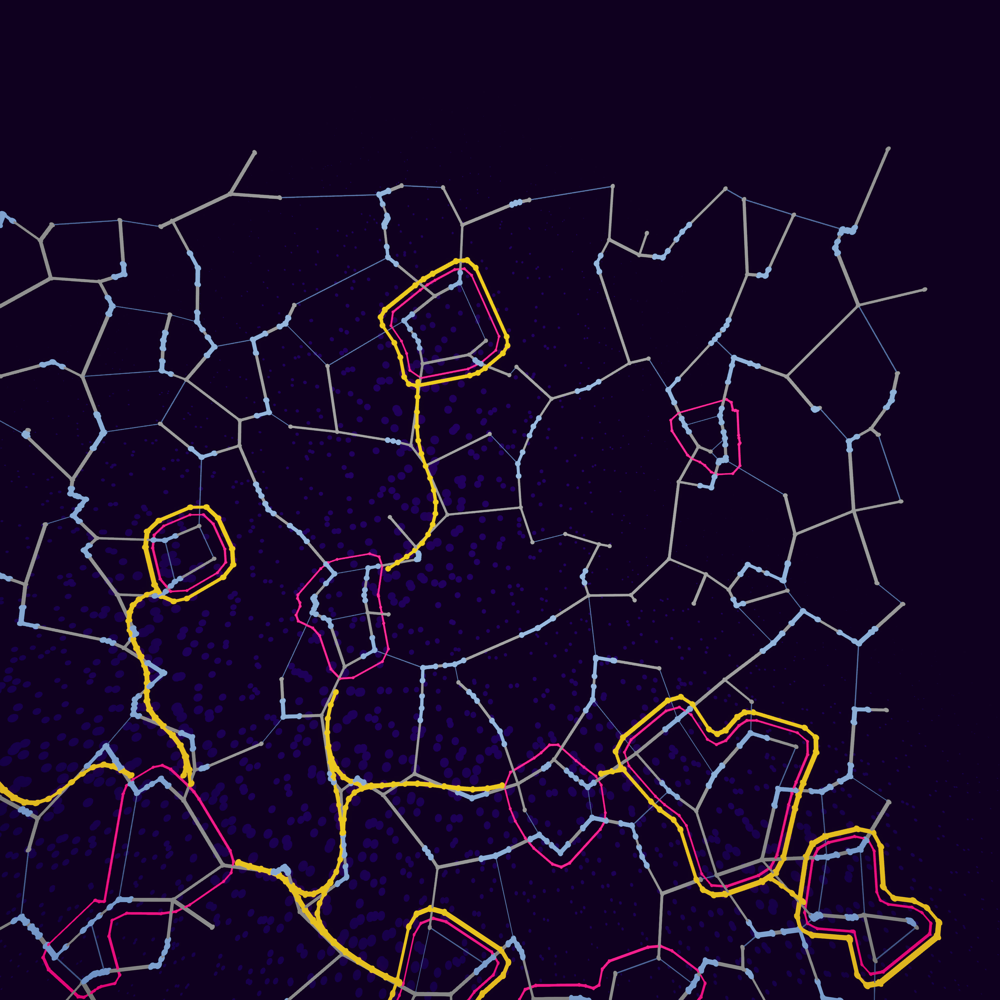
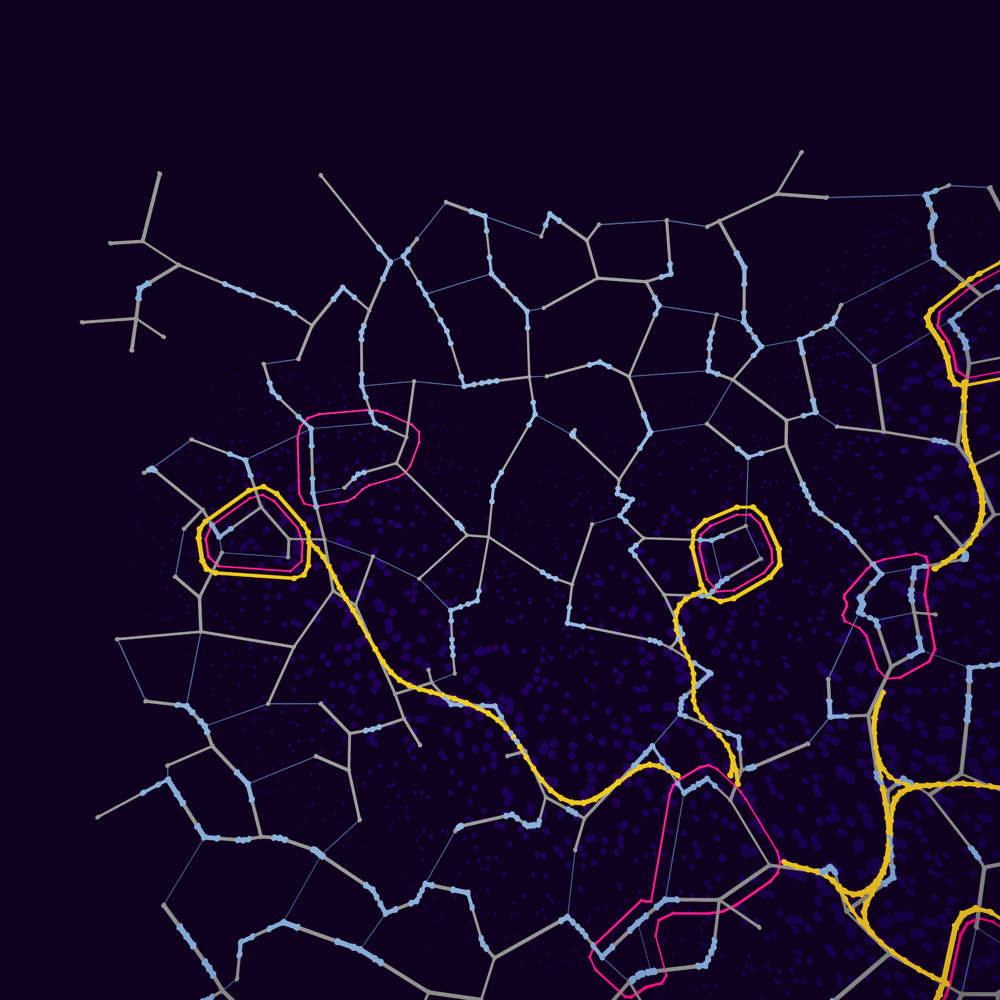
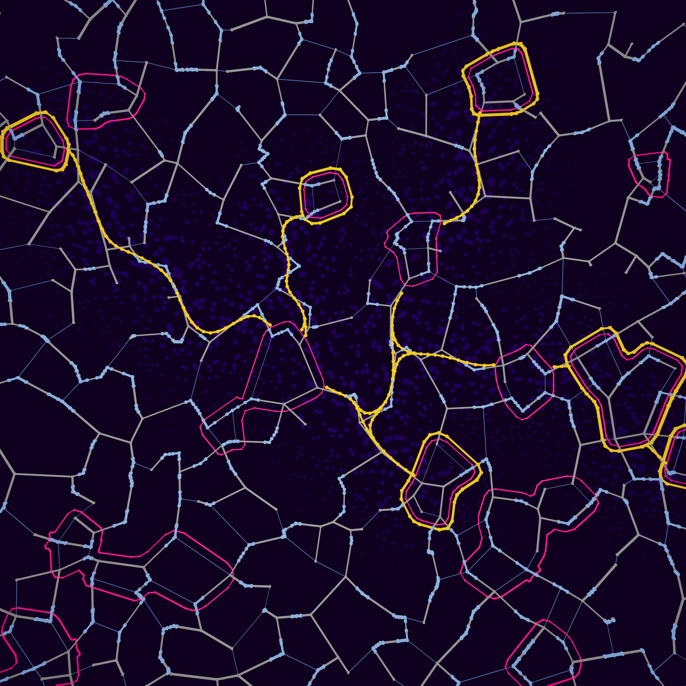

# Assets

This page provides the official logo and branding assets for use when referencing or crediting the project (e.g., in articles, videos, showcases, credit roll etc.).


Note: although the project is open source, **these assets are not freely licensed**. They are intended solely for attribution and should not be modified or used out of context.


## Typeface

PCGEx uses [**Blogger Sans** by FirstSiteGuide](https://www.behance.net/gallery/21753579/Blogger-Sans-\(Free-Typeface\)), licensed under **CC4**. You can [download it from Font Squirrel](https://www.fontsquirrel.com/fonts/blogger-sans).

## Logo

> Logos are available in .svg and .png
>
> **Right click on the image, open in new tab & save!**

#### Default version



<figure><figcaption></figcaption></figure>



<figure><figcaption></figcaption></figure>



#### Fill version

Feel free to use any color fill or mask over images things that will better fit within your branding!



<figure><figcaption></figcaption></figure>



<figure><figcaption></figcaption></figure>



#### Accent version



<figure><figcaption></figcaption></figure>



<figure><figcaption></figcaption></figure>



#### Square/no-text version



<figure><figcaption></figcaption></figure>



<figure><figcaption></figcaption></figure>



### Backdrops

<figure><figcaption>
Full backdrop
</figcaption></figure>

<figure><figcaption>
Zoomed in
</figcaption></figure>

<figure><figcaption></figcaption></figure>

<figure><figcaption></figcaption></figure>

<figure><figcaption></figcaption></figure>
