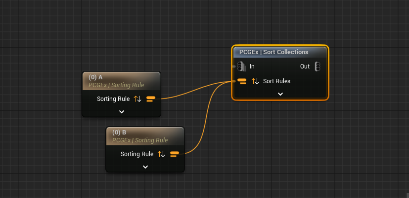

# v0.66 - Cooking


This release is being worked on and reflect the state of github main branch; it is not available on FAB yet.


## New Nodes

### Sort Collections

A simple yet handy node that let your sort data collections based on @Data domain attributes. It leverages [PCGEx Sorting Rules](../../node-library/misc/sort-points/sorting-rule.md).

<figure><figcaption>
Nice thing is, since it's @Data domain, it'll work with any data!
</figcaption></figure>

Hoping for:

* Path : Manhattan
* Path : Stitch (to stitch disconnected paths together)
* Path : Insert on Segments (to insert points into an existing path)

## Filters

Hoping for:

* Angle Filter (mainly useful for filtering paths, allows to check the angle of a point between the previous and next point)

## Tweaks

No tweaks.

## Bugfixes

No bugfixes.
